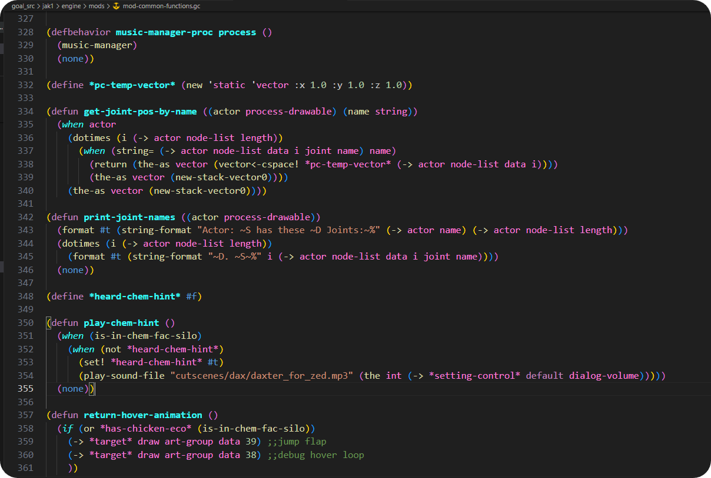

<!-- Improved compatibility of back to top link: See: https://github.com/OpenGOAL-Mods/OG-Mod-Base/pull/73 -->
<a id="readme-top"></a>
<!--
*** Thanks for checking out the Best-README-Template. If you have a suggestion
*** that would make this better, please fork the repo and create a pull request
*** or simply open an issue with the tag "enhancement".
*** Don't forget to give the project a star!
*** Thanks again! Now go create something AMAZING! :D
-->


<!-- PROJECT SHIELDS -->
<!--
*** I'm using markdown "reference style" links for readability.
*** Reference links are enclosed in brackets [ ] instead of parentheses ( ).
*** See the bottom of this document for the declaration of the reference variables
*** for contributors-url, forks-url, etc. This is an optional, concise syntax you may use.
*** https://www.markdownguide.org/basic-syntax/#reference-style-links
-->
[![Contributors][contributors-shield]][contributors-url]
[![Forks][forks-shield]][forks-url]
[![Stargazers][stars-shield]][stars-url]
[![Issues][issues-shield]][issues-url]
[![MIT License][license-shield]][license-url]


<!-- PROJECT LOGO -->
<br />
<div align="center">
  <a href="https://github.com/OpenGOAL-Mods/OG-Mod-Base">
    
  </a>

  <h3 align="center">OpenGOAL ModBASE</h3>

  <p align="center">
    A Modifed Jak Project, to make Mod development more convient!
    <br />
    <a href="https://github.com/OpenGOAL-Mods/OG-Mod-Base"><strong>Explore the docs »</strong></a>
    <br />
    <br />
    <a href="https://github.com/OpenGOAL-Mods/OG-Mod-Base">View Demo</a>
    ·
    <a href="https://github.com/OpenGOAL-Mods/OG-Mod-Base/issues/new?labels=bug&template=bug-report---.md">Report Bug</a>
    ·
    <a href="https://github.com/OpenGOAL-Mods/OG-Mod-Base/issues/new?labels=enhancement&template=feature-request---.md">Request Feature</a>
  </p>
</div>


<!-- TABLE OF CONTENTS -->
<details>
  <summary>Table of Contents</summary>
  <ol>
    <li>
      <a href="#about-the-project">About The Project</a>
      <ul>
        <li><a href="#built-with">Built With</a></li>
      </ul>
    </li>
    <li>
      <a href="#getting-started">Getting Started</a>
      <ul>
        <li><a href="#prerequisites">Prerequisites</a></li>
        <li><a href="#installation">Installation</a></li>
      </ul>
    </li>
    <li><a href="#usage">Usage</a></li>
    <li><a href="#roadmap">Roadmap</a></li>
    <li><a href="#contributing">Contributing</a></li>
    <li><a href="#license">License</a></li>
    <li><a href="#contact">Contact</a></li>
    <li><a href="#acknowledgments">Acknowledgments</a></li>
  </ol>
</details>


<!-- ABOUT THE PROJECT -->
> [!IMPORTANT]
> Our repositories on GitHub are primarily for development of the project and tracking active issues. Most of the information you will find here pertains to setting up the project for development purposes and is not relevant to the end-user.

> [!WARNING]
> **Do not use this decompilation project without providing your own legally purchased copy of the game.** We do not distribute any assets from the game - you must use your own legitimately obtained PS2 copy of the game. We support every retail PAL, NTSC, and NTSC-J build, including Greatest Hits copies.

## About The Project
<div align="center">
<a href="https://example.com">
  
</a>
</div>

Welcome to the openGOAL Modbase! This project is designed to give modders a comprehensive foundation for creating mods for the openGOAL framework. Whether you're looking to improve existing mods or build something entirely new, this modbase provides the essential tools, resources, and documentation to get you started.

Here's why the openGOAL Modbase is perfect for modders:
* Your time should be focused on creating something amazing. A project that solves a problem and helps others
* Creating GOAL code is hard, running it shouldn't be.
* You shouldn't be doing the same tasks over and over like creating a README from scratch
* With a focus on simplicity, modbase helps you get up and running quickly, even if you have little to no programming experience.
* Thanks to the openGOAL community, this modbase is always evolving. You can contribute, suggest features, or create pull requests to make it even better. :smile:

For more information, visit jakmods.dev, or check out the documentation to learn more about how to get started and make the most out of this project.
Feel free to fork this repo, suggest changes, or open issues to help improve the openGOAL Modbase. Thanks to everyone who has contributed to making this project better!

<p align="right">(<a href="#readme-top">back to top</a>)</p>


### Recommend Software

This section should list any major frameworks/libraries used to bootstrap your project. Leave any add-ons/plugins for the acknowledgements section. Here are a few examples.
* [![Githubdesktop][Githubdesktop]][githubdesktop-url]
* [![Githubaccount][Githubaccount]][githubaccount-url]
* [![VSCode][VSCode]][VSCode-url]
* [![OpenGOAL-VSCode][OpenGOAL-VSCode]][OpenGOAL-VSCode-url]

* [![Scoop][Scoop]][Scoop-url]
Once Scoop is installed, run the following commands in cmd:
```sh
scoop install git llvm nasm python task
```


<p align="right">(<a href="#readme-top">back to top</a>)</p>

<!-- GETTING STARTED -->
## Getting Started


<!--
Cover basics here with links and images
1. Getting github desktop
2. Getting github account
3. Making github organization
4. Forking mod base
5. Simple GOAL change (TARGETBANK)
6. Seeing the change in game.
 -->
This is an example of how you may give instructions on setting up your project locally.
To get a local copy up and running follow these simple example steps.

### Prerequisites

This is an example of how to list things you need to use the software and how to install them.
* npm
  ```sh
  npm install npm@latest -g
  ```

### Installation

_Below is an example of how you can instruct your audience on installing and setting up your app. This template doesn't rely on any external dependencies or services._

1. Get a free API Key at [https://example.com](https://example.com)
2. Clone the repo
   ```sh
   git clone https://github.com/github_username/repo_name.git
   ```
3. Install NPM packages
   ```sh
   npm install
   ```
4. Enter your API in `config.js`
   ```js
   const API_KEY = 'ENTER YOUR API';
   ```
5. Change git remote url to avoid accidental pushes to base project
   ```sh
   git remote set-url origin github_username/repo_name
   git remote -v # confirm the changes
   ```

<p align="right">(<a href="#readme-top">back to top</a>)</p>


<!-- USAGE EXAMPLES -->
## Usage

Use this space to show useful examples of how a project can be used. Additional screenshots, code examples and demos work well in this space. You may also link to more resources.

_For more examples, please refer to the [Documentation](https://example.com)_

<p align="right">(<a href="#readme-top">back to top</a>)</p>


<!-- ROADMAP -->
## Roadmap

- [x] Add Changelog
- [x] Add back to top links
- [ ] Add Additional Templates w/ Examples
- [ ] Add "components" document to easily copy & paste sections of the readme
- [ ] Multi-language Support
    - [ ] Chinese
    - [ ] Spanish

See the [open issues](https://github.com/OpenGOAL-Mods/OG-Mod-Base/issues) for a full list of proposed features (and known issues).

<p align="right">(<a href="#readme-top">back to top</a>)</p>


<!-- CONTRIBUTING -->
## Contributing

Contributions are what make the open source community such an amazing place to learn, inspire, and create. Any contributions you make are **greatly appreciated**.

If you have a suggestion that would make this better, please fork the repo and create a pull request. You can also simply open an issue with the tag "enhancement".
Don't forget to give the project a star! Thanks again!

1. Fork the Project
2. Create your Feature Branch (`git checkout -b feature/AmazingFeature`)
3. Commit your Changes (`git commit -m 'Add some AmazingFeature'`)
4. Push to the Branch (`git push origin feature/AmazingFeature`)
5. Open a Pull Request

### Top contributors:

<a href="https://github.com/OpenGOAL-Mods/OG-Mod-Base/graphs/contributors">
  
</a>

<p align="right">(<a href="#readme-top">back to top</a>)</p>


<!-- LICENSE -->
## License

Distributed under the ISC License. See `LICENSE.txt` for more information.

<p align="right">(<a href="#readme-top">back to top</a>)</p>


<!-- CONTACT -->
## Contact

Zed - [@ZedBotNA](https://x.com/zedbotna) - Discord: zedb0t

Barg - [@barg034](https://x.com/barg034) - Discord: barg034


Project Link: [https://github.com/your_username/repo_name](https://github.com/your_username/repo_name)

<p align="right">(<a href="#readme-top">back to top</a>)</p>


<!-- ACKNOWLEDGMENTS -->
## Acknowledgments

Use this space to list resources you find helpful and would like to give credit to. I've included a few of my favorites to kick things off!

* [Main OpenGOAL Project](https://github.com/open-goal/jak-project)
* [Jak Mods Website](https://jakmods.dev/)
<!-- * [Malven's Flexbox Cheatsheet](https://flexbox.malven.co/)
* [Malven's Grid Cheatsheet](https://grid.malven.co/)
* [Img Shields](https://shields.io)
* [GitHub Pages](https://pages.github.com)
* [Font Awesome](https://fontawesome.com)
* [React Icons](https://react-icons.github.io/react-icons/search) -->

<p align="right">(<a href="#readme-top">back to top</a>)</p>


<!-- MARKDOWN LINKS & IMAGES -->
<!-- https://www.markdownguide.org/basic-syntax/#reference-style-links -->
[contributors-shield]: https://img.shields.io/github/contributors/OpenGOAL-Mods/OG-Mod-Base.svg?style=for-the-badge
[contributors-url]: https://github.com/OpenGOAL-Mods/OG-Mod-Base/graphs/contributors
[forks-shield]: https://img.shields.io/github/forks/OpenGOAL-Mods/OG-Mod-Base.svg?style=for-the-badge
[forks-url]: https://github.com/OpenGOAL-Mods/OG-Mod-Base/network/members
[stars-shield]: https://img.shields.io/github/stars/OpenGOAL-Mods/OG-Mod-Base.svg?style=for-the-badge
[stars-url]: https://github.com/OpenGOAL-Mods/OG-Mod-Base/stargazers
[issues-shield]: https://img.shields.io/github/issues/OpenGOAL-Mods/OG-Mod-Base.svg?style=for-the-badge
[issues-url]: https://github.com/OpenGOAL-Mods/OG-Mod-Base/issues
[license-shield]: https://img.shields.io/github/license/OpenGOAL-Mods/OG-Mod-Base.svg?style=for-the-badge
[license-url]: https://github.com/OpenGOAL-Mods/OG-Mod-Base/blob/master/LICENSE.txt
[linkedin-shield]: https://img.shields.io/badge/-LinkedIn-black.svg?style=for-the-badge&logo=linkedin&colorB=555
[linkedin-url]: https://linkedin.com/in/othneildrew
[product-screenshot]: docs/img/Goal-code-preview.png


[Githubdesktop]: https://img.shields.io/badge/Github_Desktop-4C4CFF?style=for-the-badge&logo=github&logoColor=white
[Githubdesktop-url]: https://angular.io/

[Githubaccount]: https://img.shields.io/badge/Github_Account-4C4CFF?style=for-the-badge&logo=github&logoColor=white
[Githubaccount-url]: https://angular.io/

[VSCode]: https://img.shields.io/badge/VS_Code-007ACC?style=for-the-badge&logo=visual-studio-code&logoColor=white
[VSCode-url]: https://code.visualstudio.com/

[OpenGOAL-VSCode]: https://img.shields.io/badge/OpenGOAL_VSCode_Extension-0091D4?style=for-the-badge&logo=visual-studio-code&logoColor=white
[OpenGOAL-VSCode-url]: https://marketplace.visualstudio.com/items?itemName=OpenGOAL.openGOAL

[Scoop]: https://img.shields.io/badge/Scoop-3D9D63?style=for-the-badge&logo=scoop&logoColor=white
[Scoop-url]: https://scoop.sh/

* [![Githubdesktop][Githubdesktop]][githubdesktop-url]
* [![VSCode][VSCode]][VSCode-url]
* [![OpenGOAL-VSCode][OpenGOAL-VSCode]][OpenGOAL-VSCode-url]

